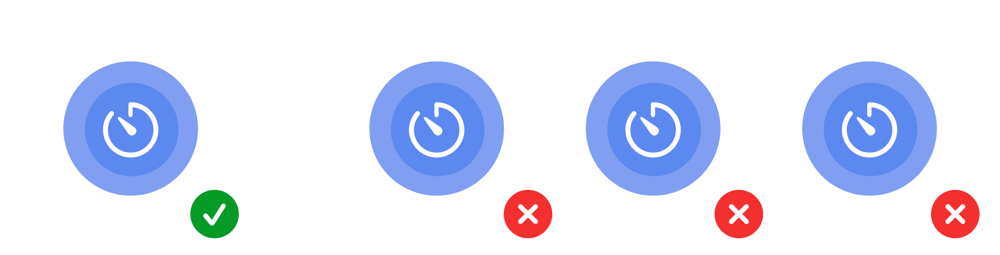

# Guidelines
## Corner Radius
- App icons must have a corner radius of `22%`.
  - This is based on the iOS app icon corner radius.

# Resources
The app icons from every batch can be found [here](appicons/).

## 2018
|  |  |  |  |  |
|:------------------------------------------------:|:--------------------------------------------:|:-----------------------------------------------:|:------------------------------------------------:|:---------------------------------------------:|
|                     BrushNow                     |                     Dice                     |                     Fractal                     |                     Parkgoer                     |                     Tasks                     |

## 2019
|  |  |  |  |  |
|:--------------------------------------------:|:----------------------------------------------:|:----------------------------------------------:|:--------------------------------------------------------:|:---------------------------------------------:|
|                     Doit                     |                     Dollar                     |                     Eureka                     |                      Idea Generator                      |                     Liste                     |

|  |  |  |  |  |
|:----------------------------------------------:|:--------------------------------------------------:|:--------------------------------------------------:|:---------------------------------------------:|:-------------------------------------------------------:|
|                     MathGo                     |                     Quizercise                     |                     ReadingPal                     |                     STUDI                     |                      Scheduler Pro                      |

|  |  |  |  |
|:---------------------------------------------:|:---------------------------------------------:|:-------------------------------------------------------:|:--------------------------------------------------:|
|                     Tasko                     |                     Tyred                     |                       Work It Out                       |                     chARacters                     |

## 2020
|  |  |  |  |  |
|:------------------------------------------------:|:--------------------------------------------:|:-------------------------------------------------:|:---------------------------------------------------:|:-------------------------------------------------:|
|                     Anything                     |                     BuSG                     |                     CATmistry                     |                     EnviroQuest                     |                     FootpRInt                     |

|  |  |  |  |  |
|:----------------------------------------------:|:------------------------------------------------:|:-----------------------------------------------:|:------------------------------------------------:|:-----------------------------------------------------------:|
|                     Fridge                     |                     Grocermi                     |                     Habitat                     |                     KillStep                     |                      MacRitchie Trails                      |

|  |  |  |  |  |
|:-------------------------------------------------:|:------------------------------------------------:|:------------------------------------------------:|:--------------------------------------------------:|:-------------------------------------------------:|
|                     ProHealth                     |                     Recipely                     |                     StudyFly                     |                     Triplanner                     |                     Wishey                     |
