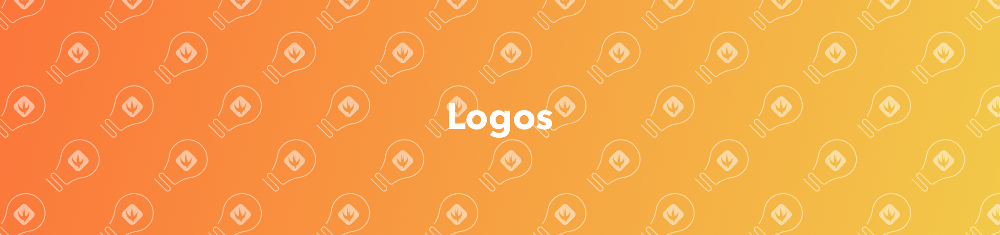
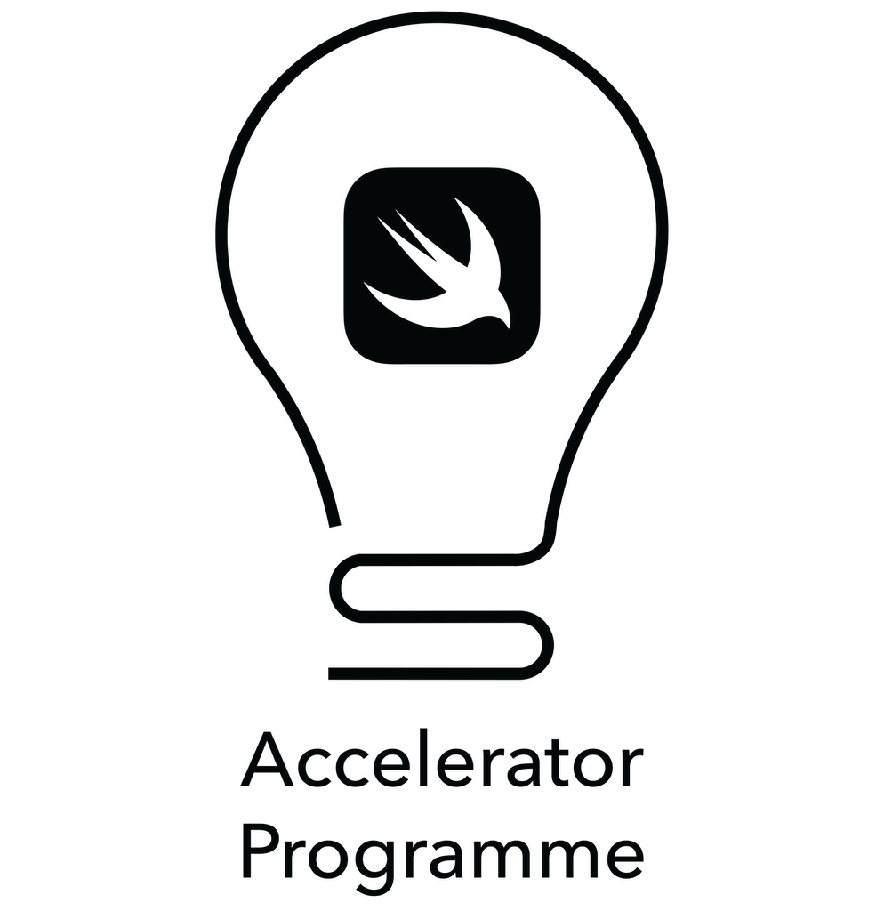
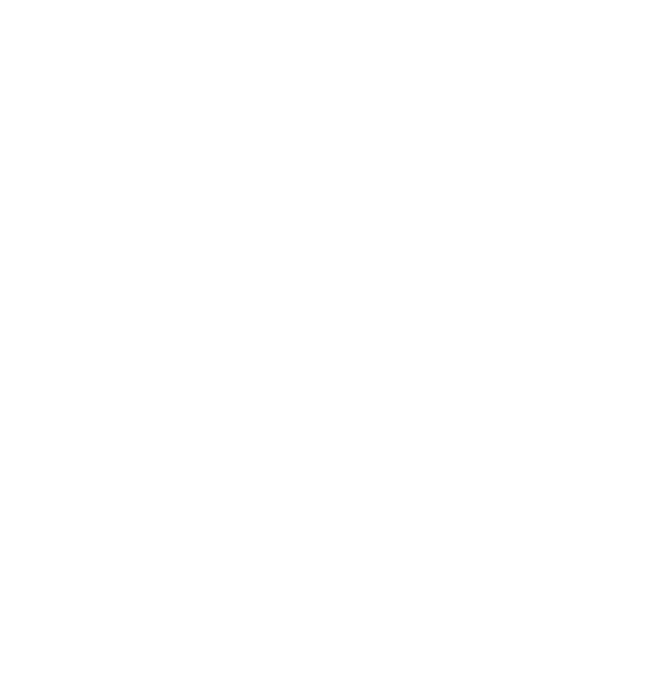
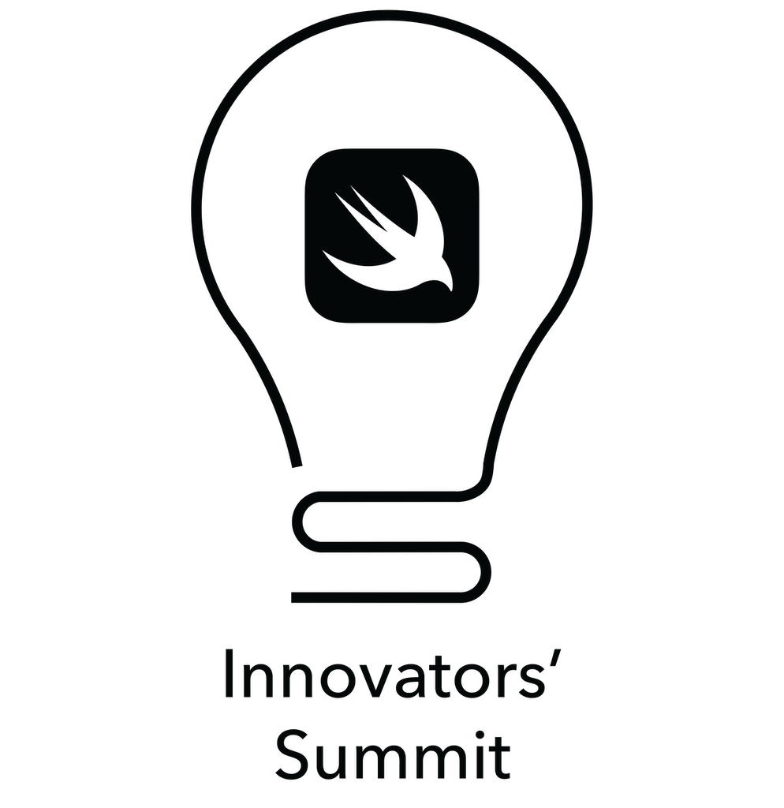
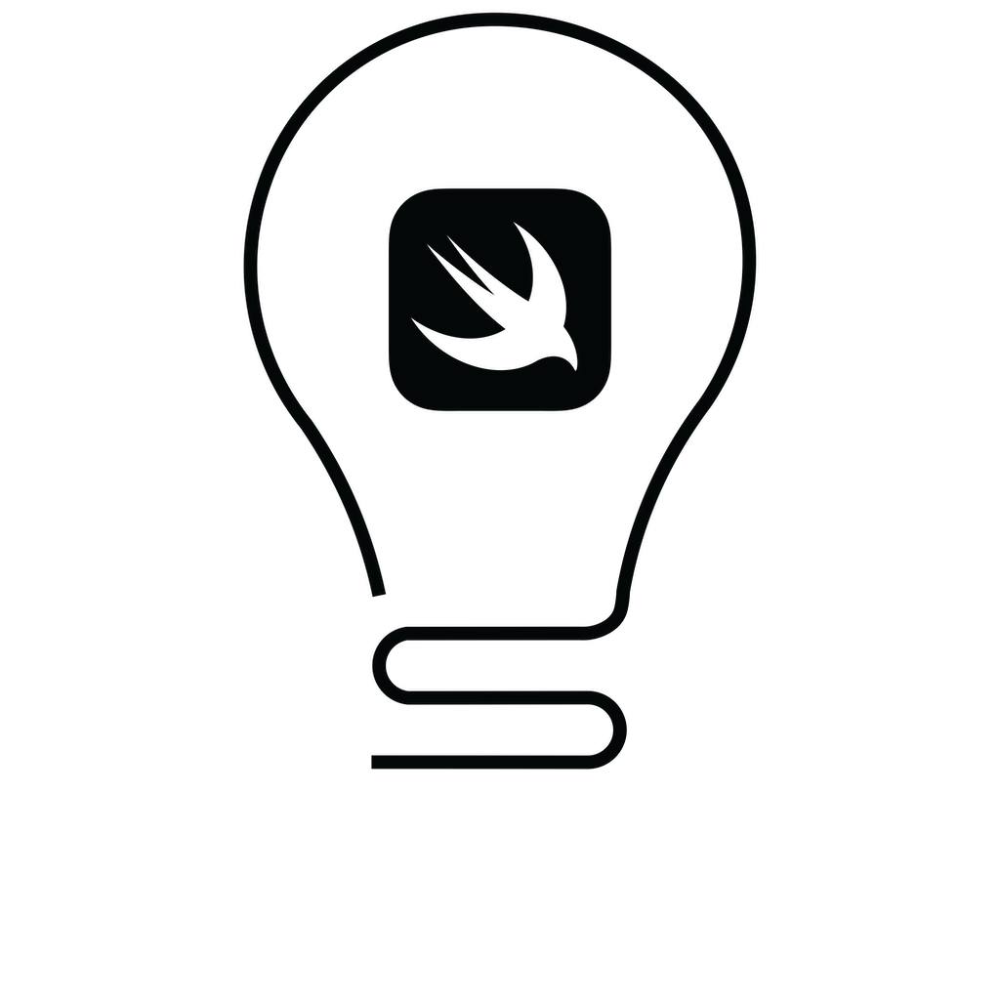
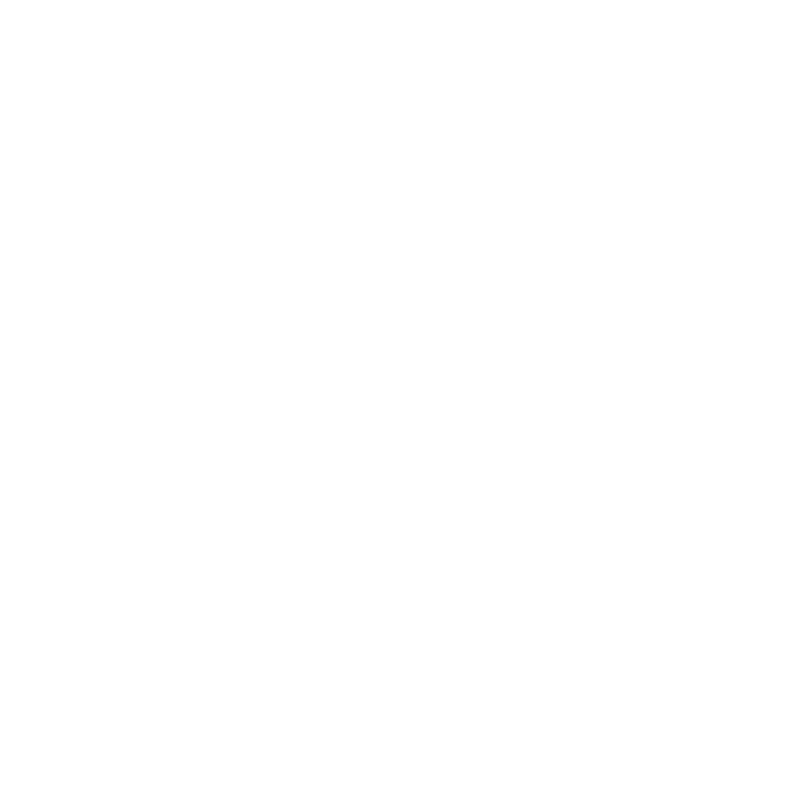

## Lockups
### Swift Accelerator Programme
Style                       | Image                                                                      | Files |
----------------------------|----------------------------------------------------------------------------|-----------------------------------------------------------------------------------------------------------------------------------------------|
Coloured - Light Background |  | [.ai](logos/lockups/sap/illustrator/coloured%20-%20light%20background.ai) [.png](logos/lockups/sap/png/coloured%20-%20light%20background.png) |
Coloured - Dark Background  |   | [.ai](logos/lockups/sap/illustrator/coloured%20-%20dark%20background.ai) [.png](logos/lockups/sap/png/coloured%20-%20dark%20background.png)   |
Black                       |                        | [.ai](logos/lockups/sap/illustrator/black.ai) [.png](logos/lockups/sap/png/black.png)                                                         |
White                       |                        | [.ai](logos/lockups/sap/illustrator/white.ai) [.png](logos/lockups/sap/png/white.png)                                                         |

### Swift Innovators' Summit
Style                       | Image                                                                      | Files |
----------------------------|----------------------------------------------------------------------------|-----------------------------------------------------------------------------------------------------------------------------------------------|
Coloured - Light Background |  | [.ai](logos/lockups/sis/illustrator/coloured%20-%20light%20background.ai) [.png](logos/lockups/sis/png/coloured%20-%20light%20background.png) |
Coloured - Dark Background  |   | [.ai](logos/lockups/sis/illustrator/coloured%20-%20dark%20background.ai) [.png](logos/lockups/sis/png/coloured%20-%20dark%20background.png)   |
Black                       |                        | [.ai](logos/lockups/sis/illustrator/black.ai) [.png](logos/lockups/sis/png/black.png)                                                         |
White                       |                        | [.ai](logos/lockups/sis/illustrator/white.ai) [.png](logos/lockups/sis/png/white.png)                                                         |

## Icon
Style                       | Image                                                                      | Files |
----------------------------|----------------------------------------------------------------------------|-----------------------------------------------------------------------------------------------------------------------------------------------|
Coloured - Light Background |  | [.ai](logos/icons/illustrator/coloured%20-%20light%20background.ai) [.png](logos/icons/png/coloured%20-%20light%20background.png) |
Coloured - Dark Background  |   | [.ai](logos/icons/illustrator/coloured%20-%20dark%20background.ai) [.png](logos/icons/png/coloured%20-%20dark%20background.png)   |
Black                       |                        | [.ai](logos/icons/illustrator/black.ai) [.png](logos/icons/png/black.png)                                                         |
White                       |                        | [.ai](logos/icons/illustrator/white.ai) [.png](logos/icons/png/white.png)                                                         |
