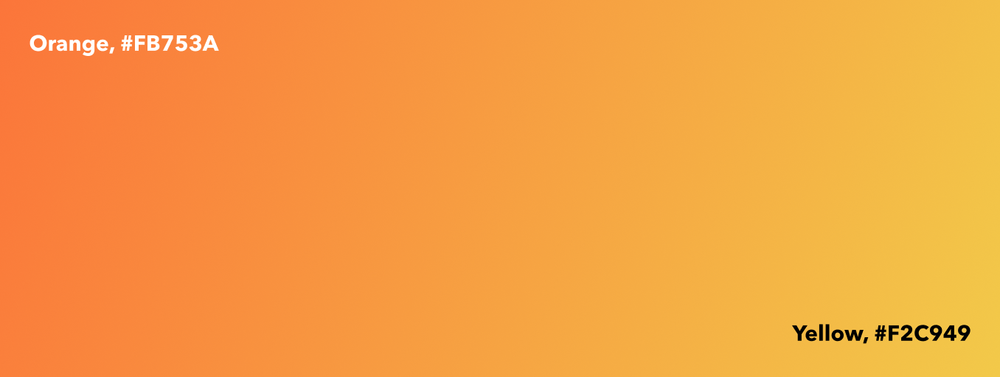
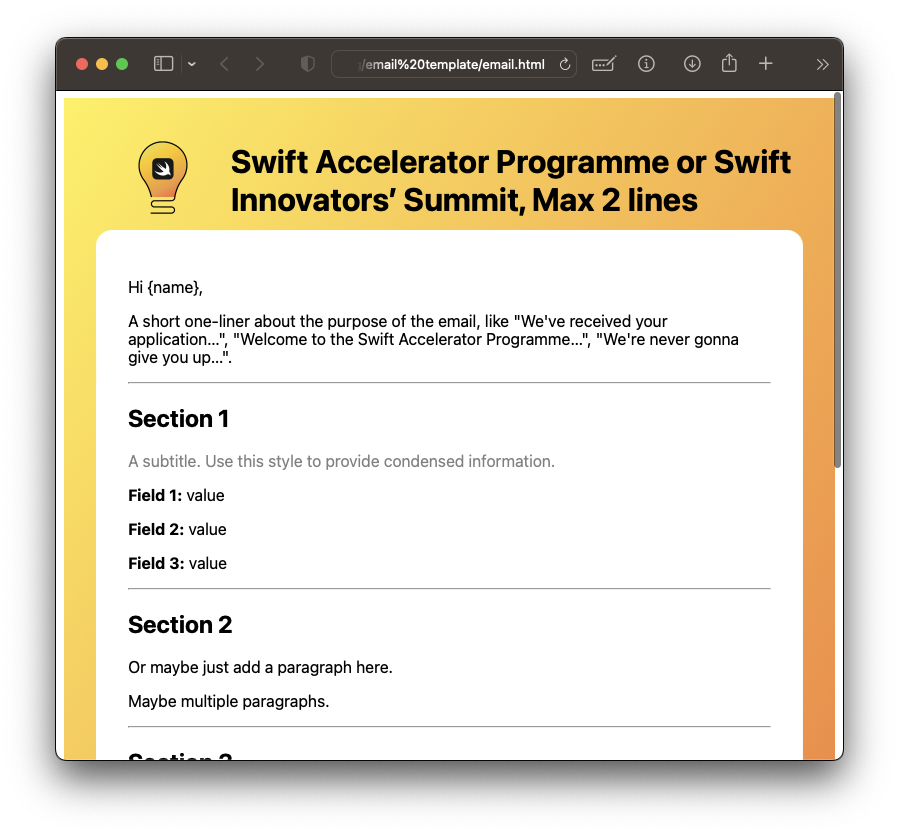

## Logos
### Lockups
#### Swift Accelerator Programme
Style                       | Image                                                                      | Files |
----------------------------|----------------------------------------------------------------------------|-----------------------------------------------------------------------------------------------------------------------------------------------|
Coloured - Light Background |  | [.ai](logos/lockups/sap/illustrator/coloured%20-%20light%20background.ai) [.png](logos/lockups/sap/png/coloured%20-%20light%20background.png) |
Coloured - Dark Background  |   | [.ai](logos/lockups/sap/illustrator/coloured%20-%20dark%20background.ai) [.png](logos/lockups/sap/png/coloured%20-%20dark%20background.png)   |
Black                       |                        | [.ai](logos/lockups/sap/illustrator/black.ai) [.png](logos/lockups/sap/png/black.png)                                                         |
White                       |                        | [.ai](logos/lockups/sap/illustrator/white.ai) [.png](logos/lockups/sap/png/white.png)                                                         |

#### Swift Innovators' Summit
Style                       | Image                                                                      | Files |
----------------------------|----------------------------------------------------------------------------|-----------------------------------------------------------------------------------------------------------------------------------------------|
Coloured - Light Background |  | [.ai](logos/lockups/sis/illustrator/coloured%20-%20light%20background.ai) [.png](logos/lockups/sis/png/coloured%20-%20light%20background.png) |
Coloured - Dark Background  |   | [.ai](logos/lockups/sis/illustrator/coloured%20-%20dark%20background.ai) [.png](logos/lockups/sis/png/coloured%20-%20dark%20background.png)   |
Black                       |                        | [.ai](logos/lockups/sis/illustrator/black.ai) [.png](logos/lockups/sis/png/black.png)                                                         |
White                       |                        | [.ai](logos/lockups/sis/illustrator/white.ai) [.png](logos/lockups/sis/png/white.png)                                                         |

### Icon
Style                       | Image                                                                      | Files |
----------------------------|----------------------------------------------------------------------------|-----------------------------------------------------------------------------------------------------------------------------------------------|
Coloured - Light Background |  | [.ai](logos/icons/illustrator/coloured%20-%20light%20background.ai) [.png](logos/icons/png/coloured%20-%20light%20background.png) |
Coloured - Dark Background  |   | [.ai](logos/icons/illustrator/coloured%20-%20dark%20background.ai) [.png](logos/icons/png/coloured%20-%20dark%20background.png)   |
Black                       |                        | [.ai](logos/icons/illustrator/black.ai) [.png](logos/icons/png/black.png)                                                         |
White                       |                        | [.ai](logos/icons/illustrator/white.ai) [.png](logos/icons/png/white.png)                                                         |

## Colours

### Gradient
From the top-left corner (Orange, #FB753A) to the bottom-right (Yellow, #F2C949).

## Fonts & Typography
- Avenir Next: Primary font used for most of the Swift Innovators' Summit assets. 
- Rubik: Consistent with Tinkercademy/Tinkertanker branding. Usually used for Swift Accelerator Programme.

## App Icons
All app icons must have a corner radius of `22%`.

The app icons from every batch can be found [here](appicons/).

## Emails
JotForm auto-responder email template for the Swift Accelerator Programme or Swift Innovators' Summit. ([.html](email/email.html))

