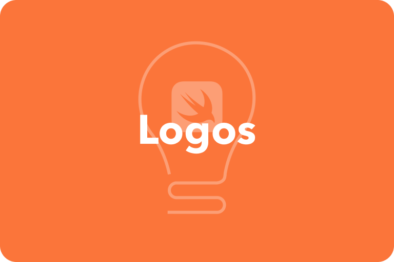
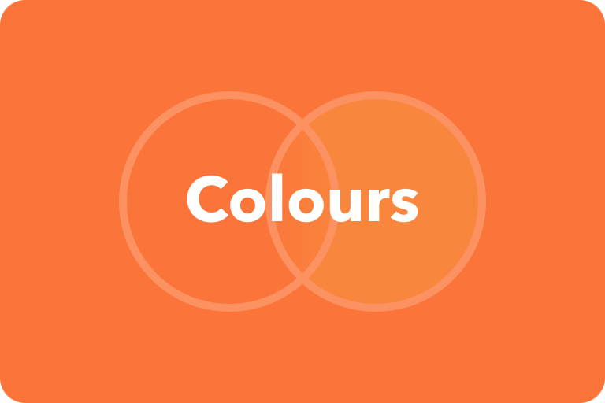
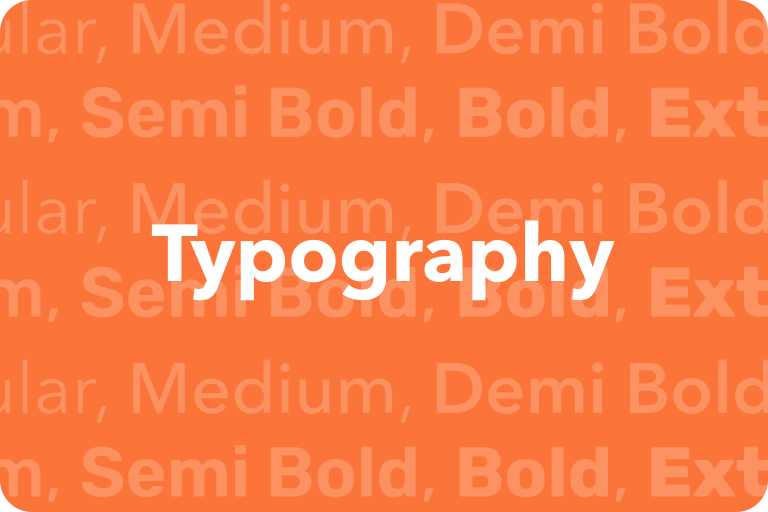
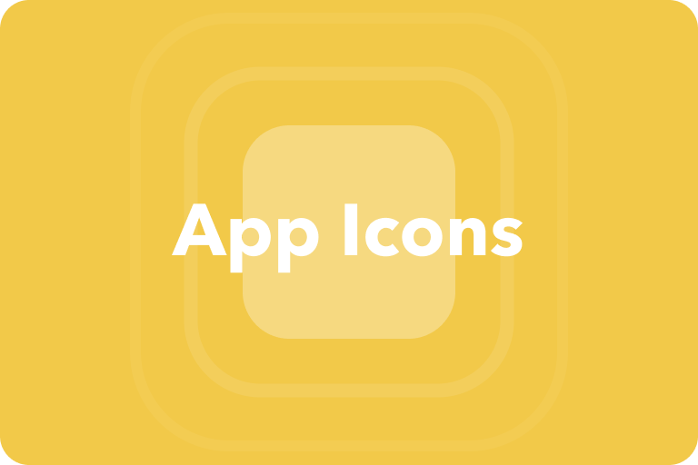
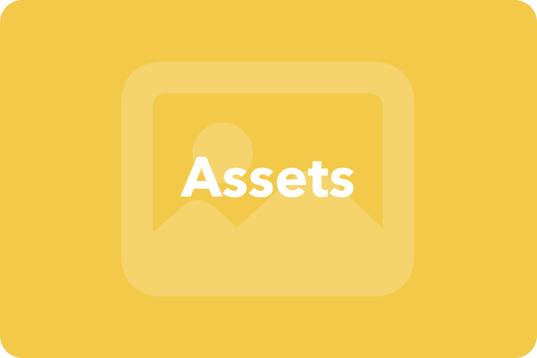

# Guidelines & Resources
The Swift Accelerator Programme/Swift Innovators' Summit brand guidelines helps to ensure that the brand maintains a constant visual identity.

## Highlights
 

## Others
 

# Contributing
These guides and resources are not set in stone. This repository is designed as a one-stop spot for anyone who needs Swift Accelerator Programme/Swift Innovators' Summit brand assets and guidelines, providing a way for us to pass information through different batches of the programme. 

Do help to keep the content in this repository up to date by submitting a pull request with any amendments should any information in this guide become outdated, or new guidelines are created.
