# Guidelines
## Avenir Next
- Used for the Swift Innovators' Summit.
- Primary font used for most of the Swift Innovators' Summit assets.
- Built-in typeface on Mac.

## Rubik
- Used for the Swift Accelerator Programme.
- Consistent with Tinkercademy/Tinkertanker branding. 
- Download typeface from [Google Fonts](https://fonts.google.com/specimen/Rubik).

# Samples

<h2>Avenir Next</h2>

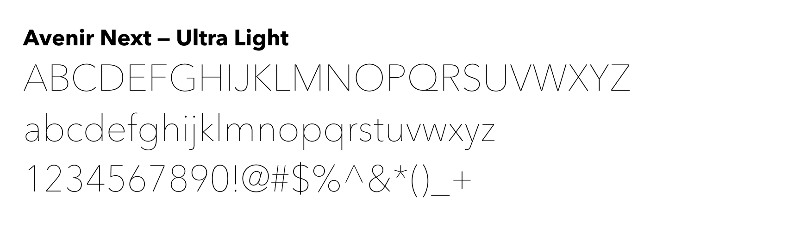
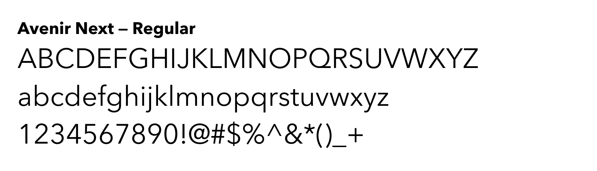
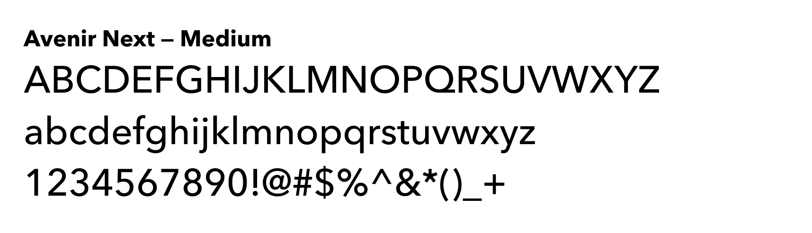
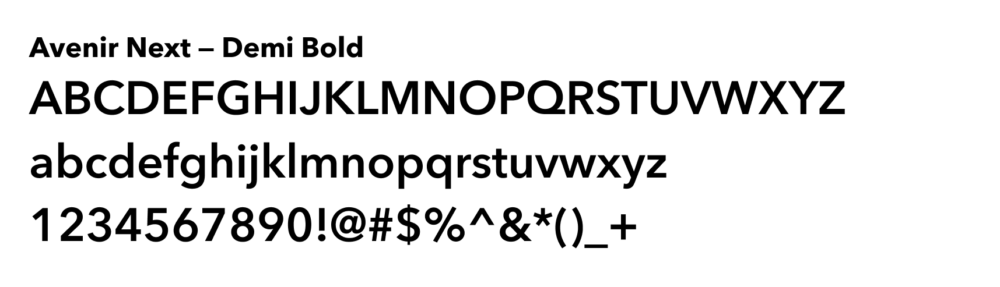
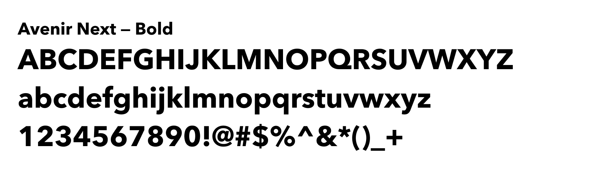
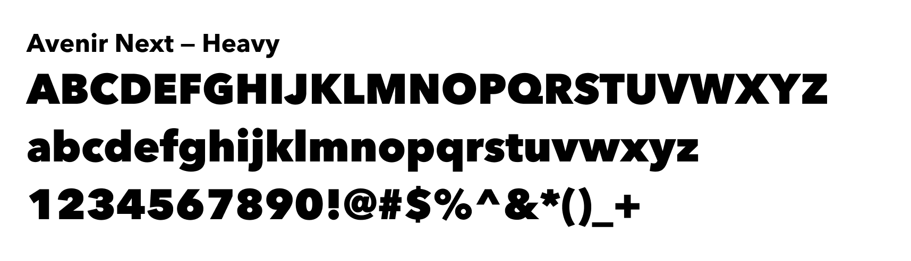

<h2>Rubik</h2>

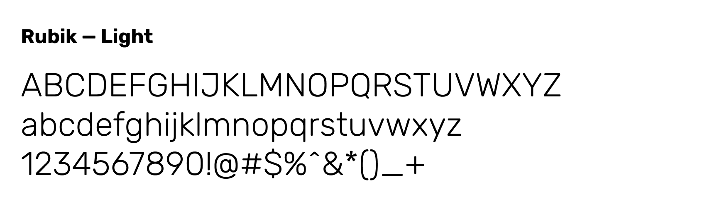
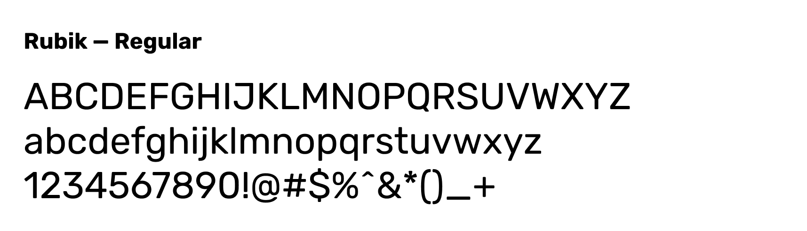
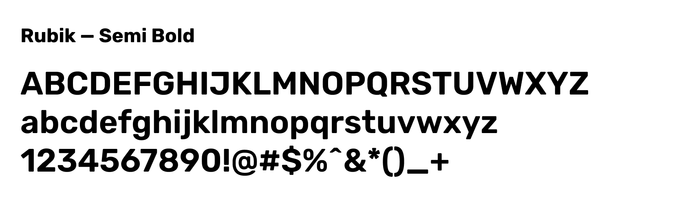
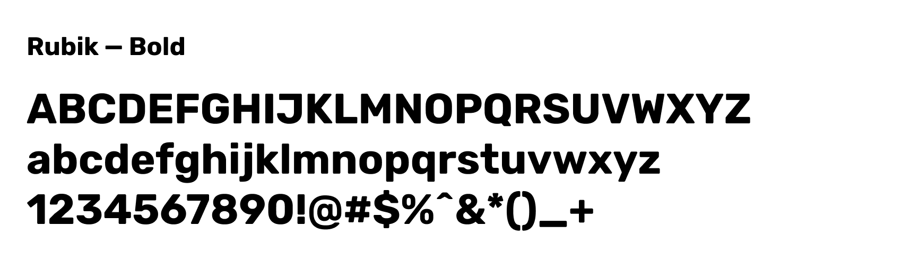
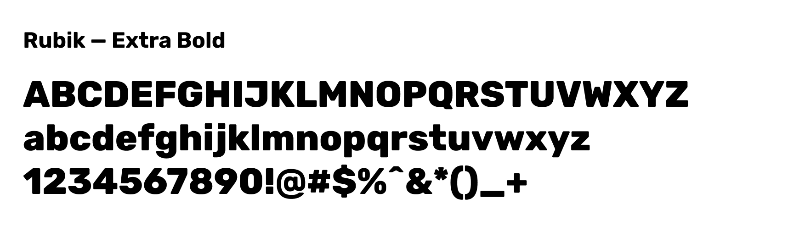
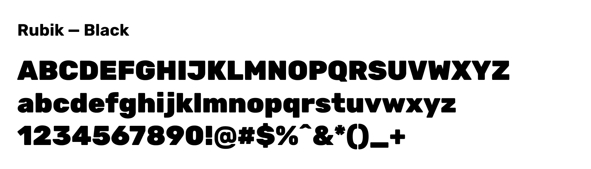

# Others
## Ailerons (Deprecated)
- Used in 2018 as part of the summit design, alongside Avenir Next.
- Notably used in the 2018 shirt design.

Sample

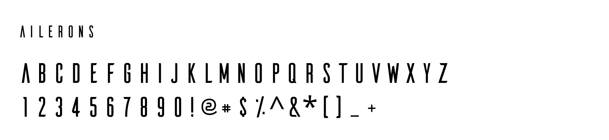

