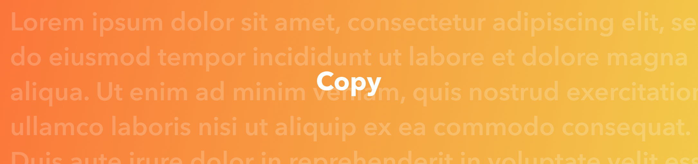

# Guidelines
## Writing Style
For Swift Accelerator communications, it is vital all communications sound consistent.
- British English.
  - We use colour, not color.
- Oxford commas
  - "apple, banana, and tomato" not "apple, banana and tomato"

## Adapt Standard Copies
Adapt the standard copies below to fit your needs. This allows for all related communications to sound the same, and portray the programme in the same way.

# Standard Copies
These are standard paragraphs used to describe the Swift Accelerator Programme and Tinkercademy. 

## Swift Accelerator Programme
### Short
The Swift Accelerator Programme is an intensive talent development programme for secondary school students with an interest and aptitude for app development and computational thinking. Over 8 months, participants learn to code in Swift, and apply story-telling and design thinking principles to design, build, and release an iOS app of their own.

### Medium
The Swift Accelerator Programme is an intensive talent development programme for secondary school students with an interest and aptitude for app development and computational thinking. Over 8 months, participants learn to code in Swift, and apply story-telling and design thinking principles to design, build, and release an iOS app of their own. 

First launched in 2018 by IMDA and Apple, the programme has been helping groups of young coders every year, by giving them the space, opportunity, and guidance in coding, story-telling, and design thinking, in order to help them take their passion to the next level.

The programme is fully subsidised for successful applicants.

## Tinkercademy
Tinkercademy is the education programmes brand of Tinkertanker Pte Ltd, a member of the Apple Consultants Network, where we teach coding and making to learners of all ages. The Swift Accelerator Programme is one of our flagship coding courses, an intensive year-long course for talented young app developers, developed and run with support from IMDA and Apple. We also run Swift Coding Clubs for students to learn to code and build apps with iPad and Xcode, as well as hands-on Swift Playgrounds workshops with micro:bit, Sphero, Dash, and more. Our vision is that everyone should be empowered to enjoy creating with technology. To that end, our mission is to inspire delight and wonder with technology, to have students learn from the best educators and crafters in the field.
