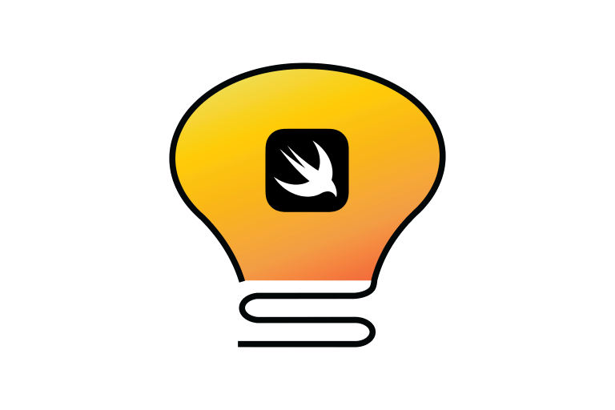
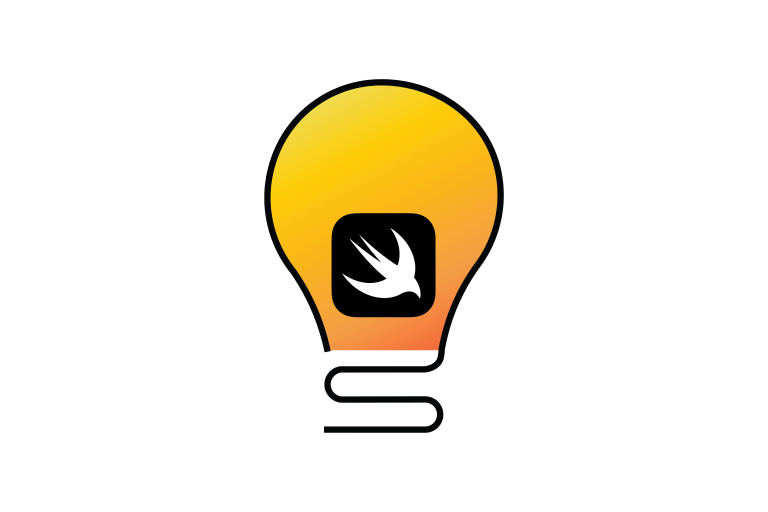
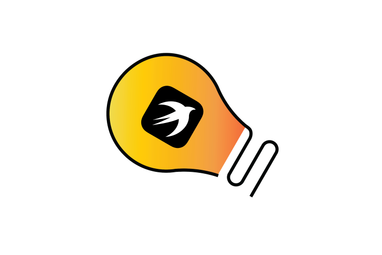
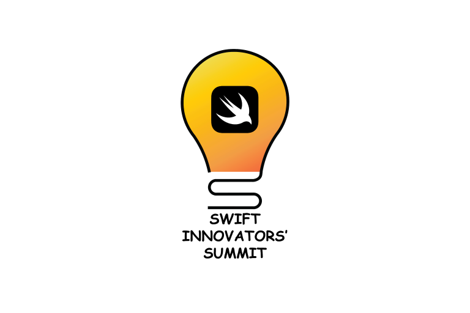
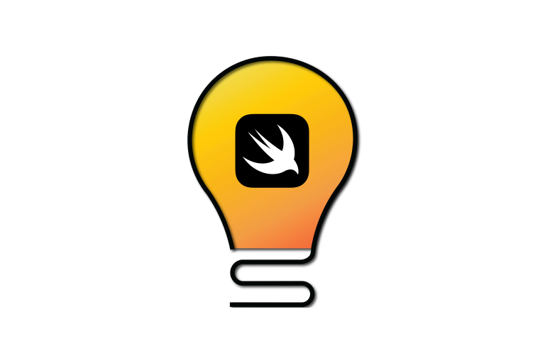
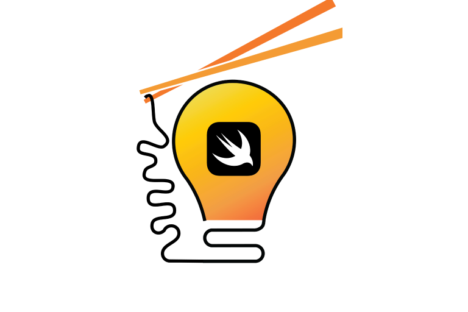
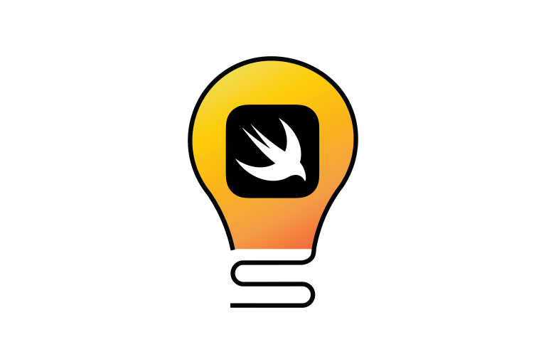
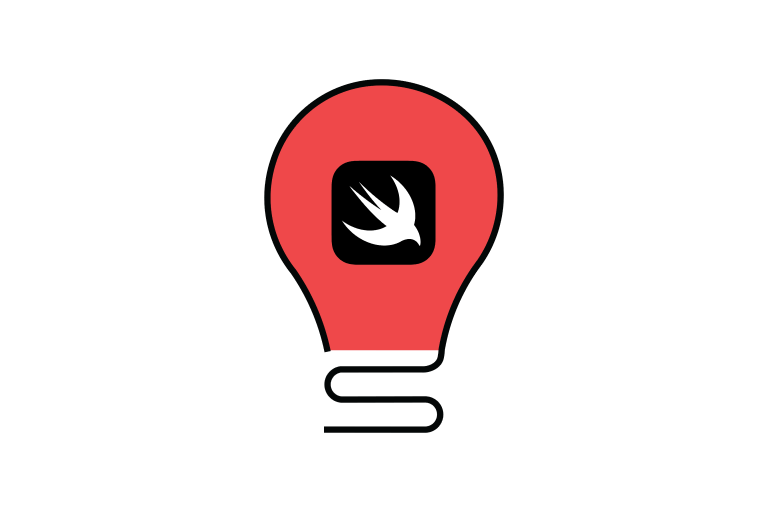
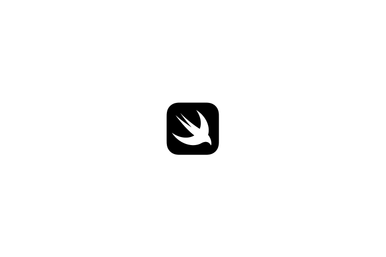

# Guidelines
## Dos
- Do use the coloured version of the logo when possible
  - Use the black or white logo on black and white layouts.
  - Do not convert the coloured logo to black and white.
- Use the light/dark background versions to ensure sufficient contrast between the logo and background, ensuring any text on the lockup remains legible.

## Don'ts

| Don't stretch, condense or change the dimensions of the identity elements. | Don't rearrange the elements of the identity. | Don't skew or warp, set it on an angle, or wrap the identity around a shape. |
|:-------------------------:|:-------------------------:|:-------------------------:|
|  |  |  |

| Don't alter or replace the typefaces in the identity. | Don't apply drop shadows or other visual effects to the identity. | Don't add extra elements to the identity. |
|:-------------------------:|:-------------------------:|:-------------------------:|
|  |  |  |

| Don't change the scale of elements in the identity. | Don't change the colour of the identity elements beyond the approved colours. | Don't touch the Swift logo. |
|:-------------------------:|:-------------------------:|:-------------------------:|
|  |  |  |

## The Swift Logo
The Swift Logo has it's own guidelines. Read more, and download it [here](https://developer.apple.com/swift/downloads/swift-logo.zip).

# Resources

<h2>Lockups</h2>

  
  ### Swift Accelerator Programme
  Style                       | Image                                                                      | Files |
  ----------------------------|----------------------------------------------------------------------------|-----------------------------------------------------------------------------------------------------------------------------------------------|
  Coloured - Light Background |  | [.ai](https://github.com/swiftinsg/branding/blob/main/logos/lockups/sap/illustrator/coloured%20-%20light%20background.ai) [.png](https://github.com/swiftinsg/branding/blob/main/logos/lockups/sap/png/coloured%20-%20light%20background.png) |
  Coloured - Dark Background  |   | [.ai](https://github.com/swiftinsg/branding/blob/main/logos/lockups/sap/illustrator/coloured%20-%20dark%20background.ai) [.png](https://github.com/swiftinsg/branding/blob/main/logos/lockups/sap/png/coloured%20-%20dark%20background.png)   |
  Black                       |                        | [.ai](https://github.com/swiftinsg/branding/blob/main/logos/lockups/sap/illustrator/black.ai) [.png](https://github.com/swiftinsg/branding/blob/main/logos/lockups/sap/png/black.png)                                                         |
  White                       |                        | [.ai](https://github.com/swiftinsg/branding/blob/main/logos/lockups/sap/illustrator/white.ai) [.png](https://github.com/swiftinsg/branding/blob/main/logos/lockups/sap/png/white.png)                                                         |
  
  ### Swift Innovators' Summit
  Style                       | Image                                                                      | Files |
  ----------------------------|----------------------------------------------------------------------------|-----------------------------------------------------------------------------------------------------------------------------------------------|
  Coloured - Light Background |  | [.ai](./lockups/sis/illustrator/coloured%20-%20light%20background.ai) [.png](./lockups/sis/png/coloured%20-%20light%20background.png) |
  Coloured - Dark Background  |   | [.ai](./lockups/sis/illustrator/coloured%20-%20dark%20background.ai) [.png](./lockups/sis/png/coloured%20-%20dark%20background.png)   |
  Black                       |                        | [.ai](./lockups/sis/illustrator/black.ai) [.png](./lockups/sis/png/black.png)                                                         |
  White                       |                        | [.ai](./lockups/sis/illustrator/white.ai) [.png](./lockups/sis/png/white.png)                                                         |
  

  
  

<h2>Icon</h2>

    
  Style                       | Image                                                                      | Files |
  ----------------------------|----------------------------------------------------------------------------|-----------------------------------------------------------------------------------------------------------------------------------------------|
  Coloured - Light Background |  | [.ai](./icons/illustrator/coloured%20-%20light%20background.ai) [.png](./icons/png/coloured%20-%20light%20background.png) |
  Coloured - Dark Background  |   | [.ai](./icons/illustrator/coloured%20-%20dark%20background.ai) [.png](./icons/png/coloured%20-%20dark%20background.png)   |
  Black                       |                        | [.ai](./icons/illustrator/black.ai) [.png](./icons/png/black.png)                                                         |
  White                       |                        | [.ai](./icons/illustrator/white.ai) [.png](./icons/png/white.png)                                                         |

